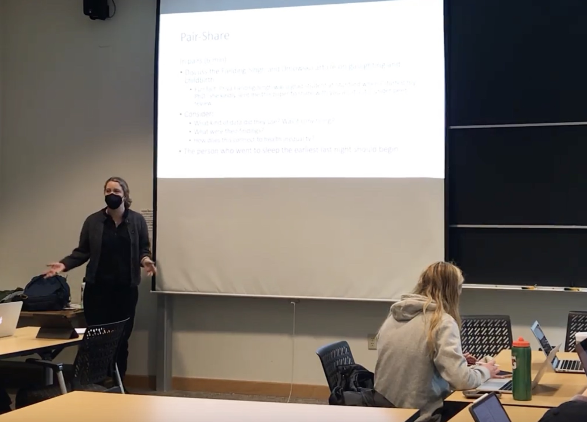

## Teaching resources
**Course syllabi**
- [SOC 123D: Mental Health from Crisis to Construction](https://drive.google.com/file/d/1rJnVnR0KRSVnwBro9Flr8mOzaNlDc24H/view?usp=sharing), Summer 2022, Stanford University 
- [SOC 152: Social Determinants of Health](https://drive.google.com/file/d/1QbKpJHUMCDV2ci_pJu73-hmDOUvAjlo7/view?usp=sharing), Winter 2022, Stanford University
- [SOC 300: The Art and Joy of Teaching](https://drive.google.com/file/d/1-X5HppCwXPSdHz1jhmEna9zlWgOLfbAT/view?usp=sharing), Spring 2021, Stanford University
- [Topics in Sociology: Mental Well-Being and Society](https://drive.google.com/file/d/1gJDhqMq6vrwVgAwamMjjwZNSsHC2FaqQ/view?usp=sharing), Summer 2020, Stanford Pre-Collegiate Summer Institutes Online
<figure>
  
  <figcaption>Teaching SOC 152 in 2022 using a Think-Pair-Share activity.</figcaption>
</figure>

**Quantitative methods materials**
- Curriculum and materials for a one-week [Statistics Bootcamp](https://aljohnson-soc.github.io/StanfordStatsBootcamp/) 
- Materials for a two-hour [Introduction to Stata workshop](https://aljohnson-soc.github.io/StataWorkshop/)
- [Video](https://www.youtube.com/watch?v=uAUYrxeUZEY) and [handout](https://drive.google.com/file/d/1K4Js5uEAg25hetxVwuKdSj6NWyHyhlbk/view) on Using Stata with Stanford’s FarmShare
- [Video](https://www.youtube.com/watch?v=9aHG95INd4c) and [handout](https://drive.google.com/file/d/1RKpsKyF_vhosd-vCTD_p1oYxUey3VUht/view) on Workflow for Quantitative Analysis

**Other resources**
- [Pedagogy to Prioritize Mental Well-Being](https://docs.google.com/document/d/15PmMvcEewnqDAO14VWoAD_KX-i0rYw1Erm_PlELuTNY/edit)
- [Responding to Student Deaths](https://teachingcommons.stanford.edu/news/responding-student-deaths) (Stanford Teaching Commons resource collaboratively developed with Stanford CTL staff)
- [Draft syllabus](https://drive.google.com/file/d/1g_O2ls09FN-GJJlbhUxyuF_sI_fhKTS8/view?usp=sharing) for Sociology of Gender introductory course
- [Draft syllabus](https://drive.google.com/file/d/1ppsMjoqm4BWyl_n0tDqkd1fGIXp89YcO/view?usp=sharing) for Classical Social Theory introductory course

## Research on teaching and learning

One line of my research trajectory builds from my pedagogy, which centers equitable, evidence-based teaching practices. In work published in *Teaching Sociology*, graduate student co-author Rebecca Gleit and I outline strategies to improve the integration of statistical software into introductory statistics courses to better prepare sociology students to be responsible citizens in a data-centered society. The Stata workshop linked above is the foundation of this paper.
- [Johnson, Amy L. and Rebecca Gleit. 2022. “Teaching for a Data-Driven Future: Intentionally Building Foundational Computing Skills.” Teaching Sociology. 50(1):49-61.](https://doi.org/10.1177/0092055X211033632)

## Student testimonials

  {% include carousel.html height="50" unit="%" duration="30" number="1" %}

My teaching evaluations are available in full [here](https://drive.google.com/drive/folders/1GtCEVBGLNKBUrZXhJrG_sf7T8wKcWNkH?usp=sharing).

## Teaching and software consulting

As a graduate student consultant with Stanford's [Center for Teaching and Learning](https://ctl.stanford.edu/ta-training-support/graduate-teaching-consultants), I offer services such as video observations and student feedback sessions to help graduate student instructors and teaching assistants improve their teaching. I also collaboratively design and teach workshops on topics such as anti-racist and equitable teaching, backwards design, active learning, and effective grading.

As a consultant with Stanford Library's [Software and Services for Data Science](https://ssds.stanford.edu/) group, I help members of the Stanford community use statistical software in their classes and/or research. I provide software support for R, Stata, Dedoose, and NVivo, as well as advice on selecting a software program, finding data, and organizing workflow and data storage.